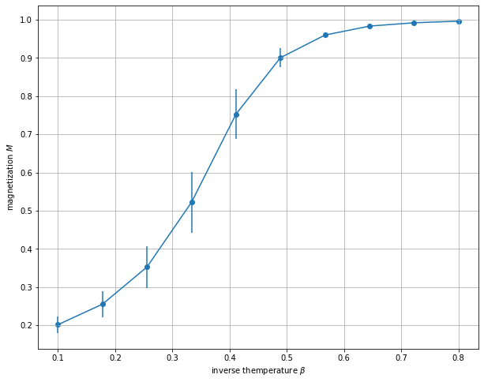
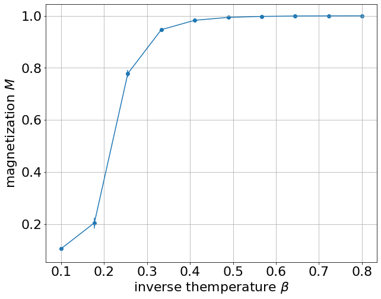
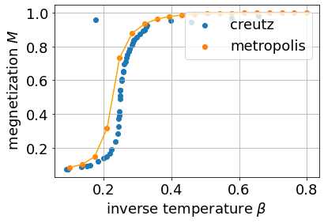
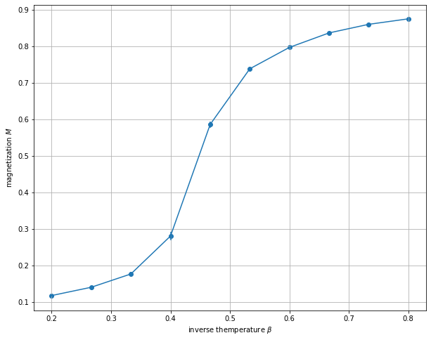
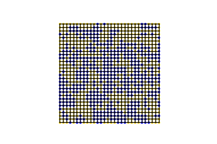
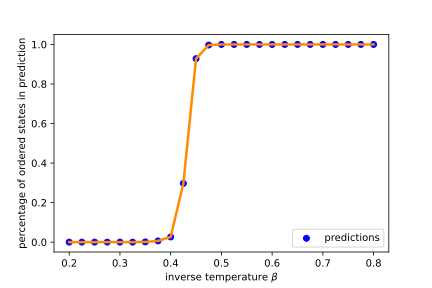
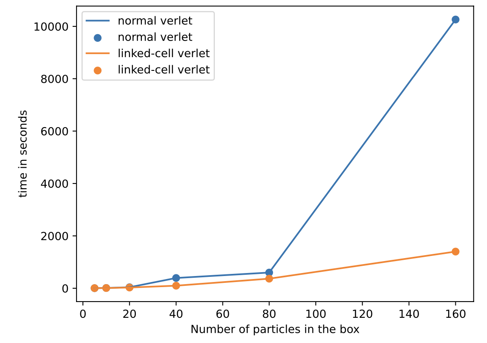
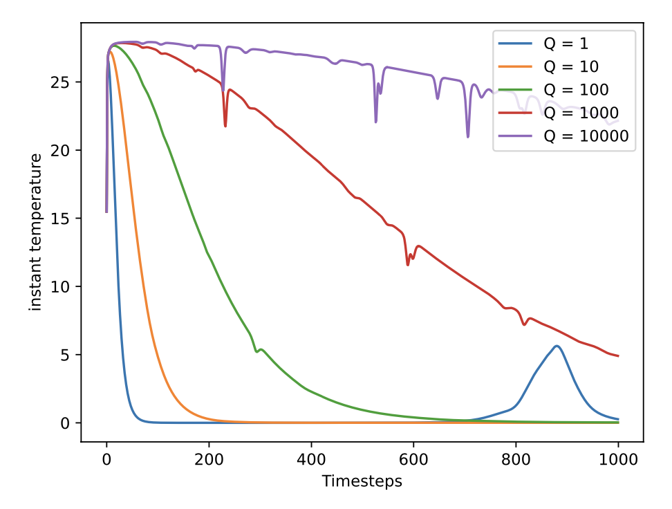

# CSP22exercises
## [ex01](ex01) 2-d Ising model. Metropolis-Hstings single spin flip Monte Carlo method.

  

## [ex02](ex02) 3-d Ising model. Metropolis-Hstings single spin flip Monte Carlo method.

  

## [ex03](ex03) 3-d Ising model. Microcanonical ensemble Monte Carlo simulation (Creutz Algorithm)

  

## [ex05](ex05) 3-d Heisenberg model. Metropolis Simulation and Cluster Algortim (Swendsen-Wang).

  

## [ex06](ex06) Supervised learning for 2-d Ising model.

  

  

## [ex07](ex07) Verlet scheme for N interacting particles in a box.

  

## [ex08](ex08) Linked-Cell method for N interacting particles in a box. 

  

## [ex10](ex10) Canonical molecular dynamics.

  

## [ex11](ex11) Event driven molecular dynamics.

  
  

## [ex12](ex12) Contact dynamics.

  

